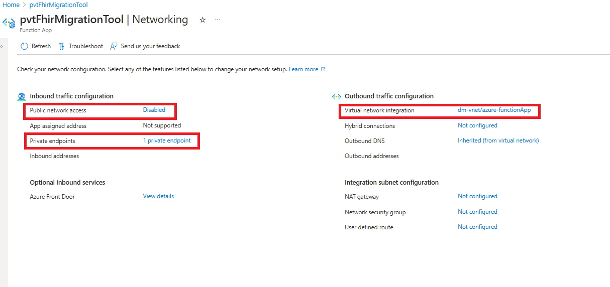

# Deploy the FHIR migration tool manually (needed if you are using Azure Private Link)

If you are using Azure Private Link, the Deploy to Azure deployment of the migration tool will not work, and you will need to deploy the migration tool manually. Follow this tutorial to learn how to deploy the migration tool manually with Azure Private Link.

# Prerequisites needed
1. An Azure account
    - You must have an active Azure account. If you don't have one, you can sign up [here](https://azure.microsoft.com/en-us/free/).

## **Steps**

## 1. Create Virtual network

 If you don't have an existing virtual network in Azure, follow these steps to create one. If you do have an existing virtual network, you can skip this step.
- **Step 1: Sign in to Azure Portal**
            
    - Open a web browser and go to the [Azure Portal](https://portal.azure.com/#home). Sign in with your Azure account credentials.
- **Step 2: Create a Virtual Network**

    - Click on "Create a resource" in the left-hand menu.
    - Search for "Virtual Network" in the search bar and then   select it from the search results.
- **Step 3: Basics**

    Fill out the "Basics" tab with the following information:
    - Subscription: Select your Azure subscription.
    - Resource group: Create a new or select an existing resource group.
    - Region: Choose the Azure region for your virtual network.
    - Name: Enter a unique name for your virtual network.
    - Click "Next: Security. 

- **Step 4: Security**
    - Configure the security settings for your virtual network if needed, such as DDoS protection and Firewall settings.
    - Click "Next: IP Addresses."

 - **Step 5: IP Addresses**
    - Configure the IP address settings for your virtual network:
        - Address space: Define the IP address range for your virtual network.
        - Subnet name: Create a subnet and specify its address range.
- **Step 6: Review + Create**
    - Review the settings you've configured.
    - Click "Create" to create the virtual network.

- **Step 7: Validation and Deployment**
    - Azure will validate your configuration. If everything is correct, it will start the deployment process.
    - You can monitor the deployment progress on the Azure Portal.    

## 2. Create Subnet for Azure API for FHIR And Azure Health Data Services FHIR service

- **Step 1: Navigate to the Virtual Network**
    - In the Azure Portal, locate and select the virtual network in which you want to create subnets.

- **Step 2: Create a Subnet for Azure API for FHIR**
    - In the virtual network settings, go to "Subnets" and click on "+ Subnet".
    - Fill out the following information :
        - Name: [Azure API for FHIR Subnet Name]
        - Address range: [Azure API for FHIR Subnet Address Range]
    - Click "Save".

- **Step 3: Create a Subnet for Azure Health Data Services FHIR service**
    - Click on "+ Subnet" again.
    - Fill out the following information :
        - Name: [Azure Health Data Services FHIR service Subnet Name]
        - Address range: [Azure Health Data Services FHIR service Subnet Address Range]
    - Click "Save".

    
## 3. Create private endpoint for Azure API for FHIR And Azure Health Data Services FHIR service
- **Step 1: Locate and select the service**
    - In the Azure Portal, locate the service for which you want to create a private endpoint.

- **Step 2: Access Networking Settings**
    - In the service's settings, locate and click on "Networking" in the left-hand menu. This is where you'll manage network settings for your service.

- **Step 3: Create Private Endpoint**
    - Within the Networking settings, locate the "+ Private Endpoint " button and click on it to initiate the creation process.

- **Step 4: Fill out the Basics**
    - You'll now be prompted to fill out various details for the private endpoint. Here's what you'll need to provide:

        - Subscription : Select the appropriate subscription from the dropdown menu.
        - Resource Group : Choose an existing resource group from the dropdown menu or create a new one by clicking "Create new" and following the prompts.
        - Name : Provide a name for your Azure API for FHIR / Azure Health Data Services FHIR service Private Endpoint.
        - Network Interface Name : This may be auto-generated or you may need to select from existing options, depending on your configuration.
        - Region : Select the appropriate region for your private endpoint.
- **Step 5: Configure Resource**
    - Once you've filled out the Basics, proceed to the Resource configuration. Here's what you'll need to provide :
        - Resource Type : This field specifies the type of resource you're connecting to with the private endpoint.
        - Resource : Here, you'll select the specific resource within the chosen resource type.
        - Target Sub-resource : This field helps you narrow down the specific aspect of the resource you're connecting to.

- **Step 6: Configure Virtual Network**
    - Virtual Network:
        - Select the Virtual Network that you want to associate with this private endpoint. This is the network in which your private endpoint will be deployed.

    - Subnet:
        - After selecting the Virtual Network, choose the specific subnet within that network where you want to deploy the private endpoint.

- **Step 7: Review and Create**
    - After completing the Basics and Resource configurations, review all the details you've provided.
    - click on the "Create" button to initiate the creation of the private endpoint. Once the deployment is complete, you'll receive a notification.
- **Step 8: Repeat Steps for Azure Health Data Services FHIR service**
    - To create a private endpoint for a Azure Health Data Services FHIR service, follow the same steps outlined above, starting from Step 1.

     

     

## 4. Secure export and import on storage account
- Refer to the official Microsoft [documentation](https://learn.microsoft.com/en-us/azure/healthcare-apis/azure-api-for-fhir/export-data#secure-export-to-azure-storage) for detailed instructions on performing a Secure Export to Azure Storage through Azure API for FHIR.
- Refer to the official Microsoft [documentation](https://learn.microsoft.com/en-us/azure/healthcare-apis/fhir/configure-import-data#securing-the-fhir-service-import-operation) 
 For detailed instructions on securing the FHIR service's  import operation.

    

 ## 5. Deploy migration tool using ARM
 - To deploy the migration tool using Azure Resource Manager (ARM), please refer to the section ["Option B: Deploy the migration tool manually through an ARM template"](/FHIR-data-migration-tool-docs#deploy-the-migration-tool) from the deployment document. Configurations for the migration tool can be done at this step using the **ARMmain.parameters.json** file.
 

## 6. Configuring secure storage of data migration tool.
This step provides detailed instructions for configuring secure storage of data migration tool. The process involves setting up networking configurations and creating a private endpoint to ensure secure access to your storage account.
- **Step 1: Configure Networking for the Storage Account**
    - Navigate to the created storage account in the Azure Portal.
    - Click on "Networking" in the left-hand menu.
    - Under the Firewalls and virtual networks section, enable the option: 'Enabled from selected virtual networks and IP addresses'.
    - Within the 'Virtual network' section, select and add the previously created existing virtual network
    - Allow Azure services on the trusted services list to access this storage account.
    - Scroll down to the "Exception" section and confirm that the option "Allow Azure services on the trusted services list to access this storage account" is selected.

      

- **Step 2: Create a Private Endpoint**
    - Once you've configured the Networking for the Storage Account, navigate to the "Private endpoint connections" section.
    - Click on "+ Private Endpoint" to create a new private endpoint connection.
    - Follow the steps outlined in Section 3 for creating private endpoint connections
    - By following these steps, you will have successfully configured secure storage in Azure with the necessary networking configurations and private endpoint connections.

      

## 7. Secure the migration tool Azure Functions App
This step offers detailed instructions on how to secure the migration tool Azure Functions App
- **Steps :**
    - Navigate to your Azure Function App in the Azure portal.On the left-hand side, find and click on the "Networking" tab.
    - Inside the "Networking" tab, click on "Access Restrictions" from the options provided.
    - Find the rule that allow public access and uncheck them. This will prevent anyone from accessing your Function App over the public internet.
    - Still inside the "Networking" tab, find and click on "Virtual Network Integration.
    - Choose the Virtual Network which you have created in section 1.
    - Select the specific Subnet within that Virtual Network that you want to use.
    - After configuring the Virtual Network and Subnet, save the changes.
    - Now, Function App will only be accessible via the specified Virtual Network and Subnet, and public access will be restricted.

    
