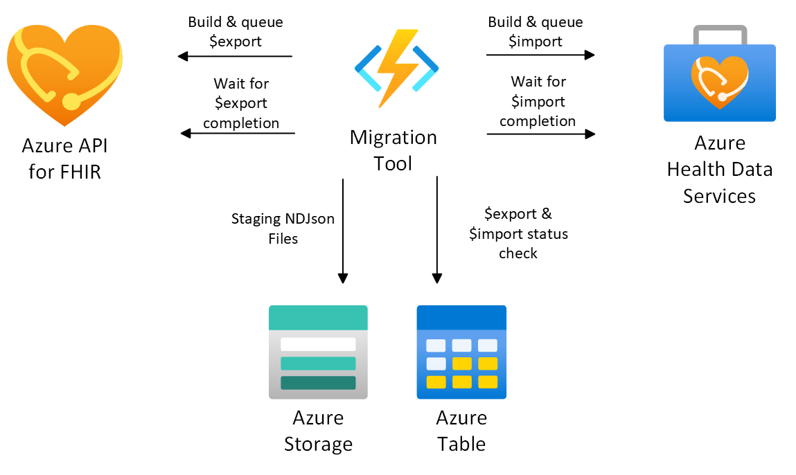
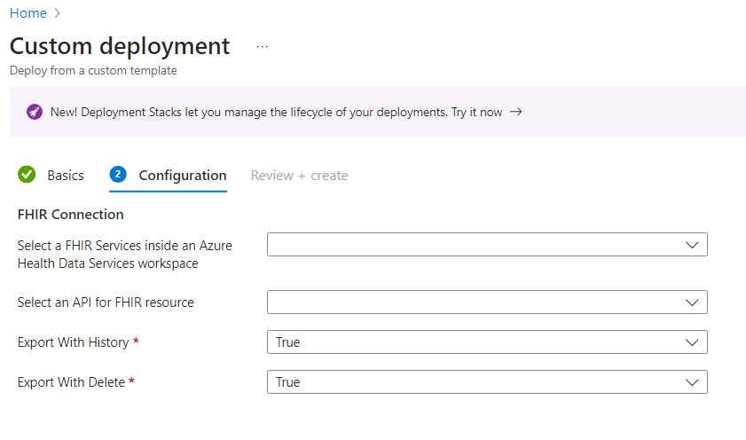
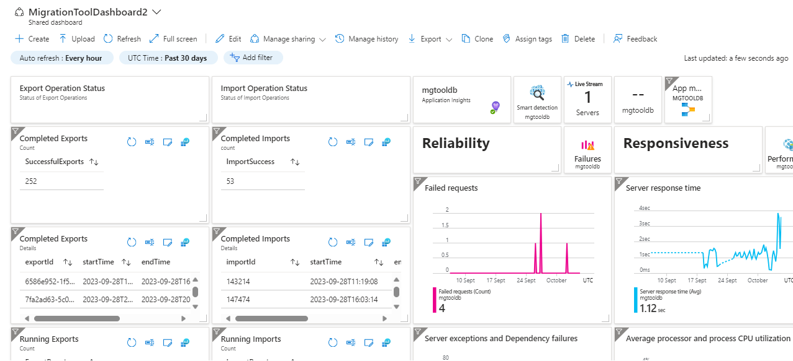
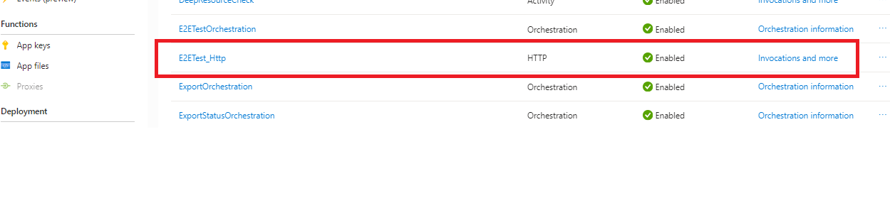
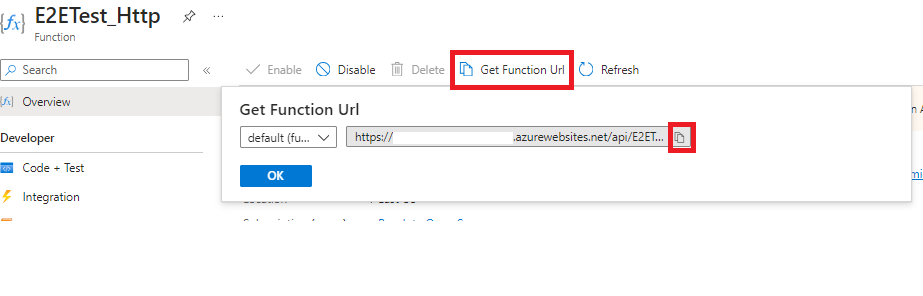
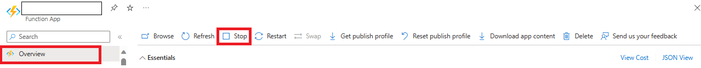

# Incremental Copy Migration Tool

The incremental copy migration tool helps you continuously copy data from an Azure API for FHIR server to an Azure Health Data Services FHIR service. This migration tool is an Azure function app solution that utilizes [$export](https://learn.microsoft.com/azure/healthcare-apis/azure-api-for-fhir/export-data) to export data from a source Azure API for FHIR server, and [$import](https://learn.microsoft.com/azure/healthcare-apis/fhir/import-data) to import to a destination Azure Health Data Services FHIR service.

The API for FHIR migration tool is an [Azure durable function](https://learn.microsoft.com/azure/azure-functions/durable/) application and uses [Azure storage table](https://learn.microsoft.com/azure/storage/tables/table-storage-overview) for capturing and maintaining the status of the export-import operation.

## Architecture Overview



### Concepts
The  incremental copy migration tool executes a series of smaller export-import rounds in succession in order to incrementally copy over **chunks** of data (default chunk is set at 30 days of data), checking every five minutes to check if the last export-import finished, and if there is new data to migrate. The five minute interval is set by the **orchestrator**. 
  - **Chunks**: The migration tool will "chunk" the data into 30-day segments (based on the resources' lastUpdated timestamp) for each round of export-import. The default is 30 days and can be adjusted (more information below). Reducing the size of the export and imports helps with the efficiency of the migration tool and helps to minimize errors.
  - **Orchestrator**: Immediately after deploying the migration tool, the migration tool will find the earliest "chunk" of data and kick off a export, followed by an import. The orchestrator then checks every 5 minutes to see if the previous export-import round has finished. If the previous export-import round has indeed finished, it will kick off the migration of the next "chunk" of data to migrate, with the process continuing on and on until you choose to end the migration tool. The orchestrator will check every 5 minutes to see if there is new data since the last export-import in the origin Azure API for FHIR server to migrate over to the destination Azure Health Data Services FHIR server. This way, you can keep your Azure API for FHIR server up and running during the migration process, and choose exactly when to cut over to the new FHIR server.


# Prerequisites needed
1. Review [general migration strategies]( https://learn.microsoft.com/azure/healthcare-apis/fhir/migration-strategies) and [limitations and list of configurations to configure](/incremental-copy-docs/Appendix.md) first. 
2.	Microsoft work or school account
3.	FHIR instances.
	-	**Source**: Azure API for FHIR server instance from where the data will be exported from.
		- Get the Azure API for FHIR server URL:
			```PowerShell
			https://<<SOURCE_ACCOUNT_NAME>>.azurehealthcareapis.com/
			```
	-	**Destination**: Azure Health Data Services FHIR service instance where the data will be imported to. If you do not already have an Azure Health Data Services FHIR server, [deploy a FHIR service within Azure Health Data services](https://learn.microsoft.com/en-us/azure/healthcare-apis/fhir/fhir-portal-quickstart). 
	
		- Get the Azure Health Data Service FHIR service URL:
			```PowerShell
			https://<<WORKSPACE_NAME>>-<<FHIR_SERVICE_NAME>>.fhir.azurehealthcareapis.com/
			```

4. Storage accountto set as both the export de stination for Azure API for FHIR and the import location for Azure Health Data Services FHIR service (5 and 6 below)
5. Configure [$export](https://learn.microsoft.com/azure/healthcare-apis/azure-api-for-fhir/configure-export-data) on the origin Azure API for FHIR server. Make sure that the intermediate Azure storage account that you plan to use for this migration is selected as the $export storage account for FHIR instance. You can do this by configuring [$export](https://learn.microsoft.com/azure/healthcare-apis/azure-api-for-fhir/configure-export-data) on the source FHIR instance (Azure API for FHIR server). If you do not already have a storage account, create a new storage account and follow the steps for configuring [$export](https://learn.microsoft.com/azure/healthcare-apis/azure-api-for-fhir/configure-export-data) to select that storage account.
   
6. Configure [$import](https://learn.microsoft.com/azure/healthcare-apis/fhir/configure-import-data) on the destination FHIR instance (Azure Health Data Service FHIR service server) with the same storage account as the import location, and set import mode to incremental mode.

__Note__ : The Data Migration tool supports cross-subscription deployment. 

For example, if your Azure API for FHIR server is in subscription A and Azure Health Data Services FHIR server is in subscription B, and the same storage account is configured as export and import configurations for Azure API for FHIR server and Azure Health Data Services FHIR server respectively. This ensures smooth data migration across subscriptions.

> [!IMPORTANT]  
> Please ensure that your $import is set to **incremental import mode** in order for the migration tool to work. If needed, you may switch back to initial import mode post-migration. Set incremental import mode following these [configuration settings](https://learn.microsoft.com/en-us/azure/healthcare-apis/fhir/configure-import-data#step-3b-set-import-configuration-for-incremental-import-mode) and [parameter value](https://learn.microsoft.com/en-us/azure/healthcare-apis/fhir/import-data#body). Learn more about incremental and initial import [here](https://learn.microsoft.com/en-us/azure/healthcare-apis/fhir/import-data).

## Deployed Components
During the deployment of the incremental copy migration tool, the following components will be deployed:

1. Azure Functions app
	- The data migration tool code is deployed in Azure Functions. The migration tool function app acts as the orchestrator.
2. Storage account
	- A new storage account will be linked to the migration tool function app and will be used to store and monitor the export-import data. The table storage inside this new storage account will capture and store the details for each export-import round.  This new storage account will be different from the storage account that you designated for export-import storage location.
3. Shared Dashboard
	- The dashboard captures and visualizes the details for each export-import of data. 

4. Application Insights
	- This will capture the logs of the migration tool function app. 

## Deployment
### Portal Deployment

To quickly deploy the Migration tool, you can use the Azure deployment below. Please note, if you are using Azure Private Link, please follow separate instructions for [deploying the migration tool with Azure Private Link](/incremental-copy-docs/private-link-sample/ReadMe.md).

1. Deploy the infrastructure for migration tool.
	1. **OPTION A**: Deploy the migration tool through Azure Portal using the Deploy to Azure button

		[](https://portal.azure.com/#create/Microsoft.Template/uri/https%3A%2F%2Fraw.githubusercontent.com%2FAzure%2Fapiforfhir-migration-tool%2Fmain%2Finfra%2Fmain.json/createUIDefinitionUri/https%3A%2F%2Fraw.githubusercontent.com%2FAzure%2Fapiforfhir-migration-tool%2Fmain%2Finfra%2FuiDefForm.json)

    **NOTE** : Choose your own unique "Prefix for FHIR Migration Tool resources" during deployment.

    2. **OPTION B**: Or, deploy the migration tool manually:
		<br />
		<details>
		<summary>Click to expand to see manual deployment instructions.</summary>

		1. Clone this repo
			```azurecli
			git clone https://github.com/Azure/apiforfhir-migration-tool.git --depth 1
			```
		2. Log in to Azure  
			Before you begin, ensure that you are logged in to your Azure account. If you are not already logged in, follow these steps:
			```
			az login
			```
		3. Set the Azure Subscription  
			If you have multiple Azure subscriptions and need to specify which one to use for this deployment, use the az account set command:
			```
			az account set --subscription [Subscription Name or Subscription ID]
			```
			Replace [Subscription Name or Subscription ID] with the name or ID of the subscription you want to use for this deployment. You can find your subscription information by running az account list.

			**Note** : This step is particularly important if you have multiple subscriptions, as it ensures that the resources are deployed to the correct subscription.

		4. If needed, create a resource group

			If you don't already have a resource group that you want to use, use the following command to create a resource group.  
			```
				az group create --name <resource_group_name> --location <location>
			```  
			Replace <*resource_group_name*> with your desired name and <*location*> with the Azure region where you want to create the resource group

		5. Deploy the function  
			Now, you can initiate the deployment using the Azure CLI
			```
			az deployment group create --resource-group<resource-group-name> --template-file <path-to-template> --parameters <path-to-parameter>
			```
			- <*resource-group-name*>: Replace this with the name of the resource group you want to use.
			- <*path-to-template*>: Provide the path to the ARM/Bicep template file i.e. main.json under infra folder.
			- <*path-to-parameter*>: Specify the path to the parameters file i.e. armmain.parameters.json under infra folder.

      	**NOTE** : Choose your own unique "Prefix for FHIR Migration Tool resources" during deployment.

		
		</details>
		<br />
	
## Export FHIR Data from API for FHIR server

The [built-in API for FHIR $export operation](https://learn.microsoft.com/azure/healthcare-apis/azure-api-for-fhir/export-data) is leveraged in this migration tool for exporting the data from API for FHIR server. The $export PaaS endpoints are asynchronous, long-running HTTP APIs. 
The storage account is used for staging NDJSON files between the $export and $import. The storage account is also used by Azure Durable Functions to store state. 

In the migration tool we are using $export [query](https://learn.microsoft.com/azure/healthcare-apis/azure-api-for-fhir/export-data#query-parameters) which allows you to filter and export certain data accordingly from a source Azure API for FHIR server.

The migration tool hits the HTTP APIs endpoint for the $export operation, the response contains export operation Content-Location URL. The content-location URL give the status on export operation. Each $export operation status is stored in Azure storage table.

The migration tool exports 30 days which is configurable by using parameters: ExportChunkTime and ExportChunkDuration of data from API for FHIR in each export operation.

#### How to configure Chunk Duration and Time for export.
1. Open the Data migration Azure function.
2. Go to the environment variable setting and under it go to App Setting.
3. Set the below configuration as per the need:
```
Name: AZURE_ExportChunkDuration
Value: "Days" or "Hours" or "Minutes"

Name: AZURE_ExportChunkTime
Value: <<Int number>>
```
AZURE_ExportChunkDuration it can take Days, Hours or Minutes as value. If the user want the data to be exported on Days basis, put "Days" as value in it. If the user want data to be exported on Hourly basis, put "Hours" as value OR if user want to export in minutes put "Minutes" as value.

AZURE_ExportChunkTime it will take integer as value.

Example:

Below setting in azure function will export 30 days data in single chunk: 
```
Name: AZURE_ExportChunkDuration
Value: "Days"

Name: AZURE_ExportChunkTime
Value: 30
```

The user can configure the start date in Azure function from where the export should start from the API for FHIR server. AZURE_StartDate will help to export the data from that specific date. <br>
If the start date is not provided the tool will fetch the first resource date from the server and start the migration.

### Export with History and Soft Delete

Exporting with [history](https://learn.microsoft.com/en-us/azure/healthcare-apis/azure-api-for-fhir/purge-history) allows you to export current state of a resource as well as its previous versions. Exporting with [soft deletes](https://learn.microsoft.com/en-us/azure/healthcare-apis/azure-api-for-fhir/fhir-rest-api-capabilities#delete-hard--soft-delete) allows you to export soft deleted historic versions.

During the deployment of the migration tool, users have the option to enable or disable the exporting of history and soft deletes by specifying their values as true or false. This is the equivalent of setting the $export query parameter "includeAssociatedData" with _history and _deleted, as mentioned [here](https://learn.microsoft.com/en-us/azure/healthcare-apis/azure-api-for-fhir/export-data#query-parameters).

Take a look at the screenshot below to learn how to configure the export settings. By default, exporting with history and deletion is set to true. If you prefer to export without history and deletion, you can change the value to false.



Upon the completion of deployment, users can still make adjustments to the export settings for history and deletion by modifying the values within the Azure function's environment variable. 

Example:

```
Name: AZURE_ExportWithHistory
Value: True

Name: AZURE_ExportWithDelete
Value: False

```

Once the $export operation is completed, the export operation content location is stored in Azure storage table and the next export status orchestrator in the durable function picks the details from the storage table and checks the status of the export.

The migration tool is also storing the _since and _till date for the export operation in Azure storage table. Once the export operation is completed, then the import operation orchestrator starts in the migration tool application.

New export will not start until the previous import is completed on FHIR service.

## Import FHIR Data to Azure Health Data Services FHIR service

The [built-in Azure Health Data Service FHIR service $import operation](https://learn.microsoft.com/azure/healthcare-apis/fhir/import-data) is leveraged inthe  migration tool for importing the data to the destination Azure Health Data Services FHIR server.The $import PaaS endpoints are asynchronous, long-running HTTP APIs. 
The storage account is used for getting the NDJSON files between the $export and $import. The storage account is also used by Azure Durable Functions to store state. 

In the migration tool we are using $import for importing the data which got exported from the $export orchestrator.

The migration tool hits the HTTP APIs endpoint for the $import operation, the response contains import operation Content-Location URL. The content-location URL gives the status on import operation. Each $import operation status is stored in Azure storage table.

Once the $import operation is completed, the import operation content location is stored in Azure storage table and the next import status orchestrator in the durable function picks the details from storage table and checks the status of the import.

## Monitoring
### Dashboard Monitoring

During the deployment of data migration tool , the dashboard is also deployed for monitoring the data migration from Azure API for FHIR to Azure Health Data Service FHIR service. It's the visualization of each export-import runs.



Dashboard contain below details.

1. Export Operation Status.
	- Completed export counts - This gives the count of export executed on Azure API for FHIR.
	- Completed export details - This gives the details of each export executed on Azure API for FHIR.
	- Running export count - This gives the current export run count on Azure API for FHIR.
	- Running export details - This gives the details of current export run count on Azure API for FHIR.
	- Failed export count - This gives the failed export run count on Azure API for FHIR.
	- Failed export details - This gives the details of failed export run count on Azure API for FHIR.
	- Export resources details - This gives the details of export resources run count on Azure API for FHIR.
2. Import Operation Status.
	- Completed Import counts - This gives the count of import executed on FHIR service.
	- Completed Import details - This gives the details of each import executed on FHIR service.
	- Running import count - This gives the current import run count on FHIR service
	- Running import details - This gives the details of current import run count on FHIR service.
	- Failed import count - This gives the failed import run count on FHIR service.
	- Failed import details - This gives the details of failed import run count FHIR service.
	- Import resources details - This gives the details of import resources run count on FHIR service.
3. Surface Check - This give the details of surface check run for data movement verification.
4. Function App
	- Failures
	- Server exceptions and dependency failures
	- Avg processor / CPU utilization
	- Average available memory.
5. Total Resource Count - This gives the count of total resources on FHIR service and Azure API for FHIR.

### Table Storage Monitoring

During the deployment of data migration tool , the table storage [chunk and export table] linked to Function App is used to store and monitoring the data migration from Azure API for FHIR to Azure Health Data Service FHIR service. This table gives the overview and details of each export-import runs.

There are two table storage created during deployment.

1. Chunk: 
	- It stores the how many run have been done or started for the migration.
	- It stores the datetime value in since column. It indicate from which time the data should be exported from next run. This value is since in export URL for next export-import run.

2. Export:
	- This contains each export-import details.
	- It captures the time taken for each export and import.
	- It captures the status of export and import.
	- The export-import content location is capture which can be used to get the extact error occured during export-import by fetching the details through URL.


## Troubleshooting

1. Azure API for FHIR.
	-  Please see the [troubleshooting section](https://learn.microsoft.com/azure/healthcare-apis/fhir/export-data#troubleshoot) to handle issues on exporting the data.
2. Azure Health Data Services FHIR service.
	-  Please see the [troubleshooting section](https://learn.microsoft.com/azure/healthcare-apis/fhir/import-data#troubleshooting) to handle issues on importing the data.
3. To troubleshoot the error or failure of export-import. 
	- Please check the export table storage created during deployment process linked to Azure function app.
		- It contain the details for each export-import error status.
	- Please check the details of export-import failure on dashboard as well
		- Export failure details can be found in Failed Export details 
		- Import failure details can be found in Failed Import details 
    

## Data Movement Verification

You can verify that the data was successfully copied over using the below checks.

1. Surface Check <br>
    For a quick validation, you can use the surface check. It compares the number  of resources of a particular FHIR resource type between the API for FHIR and FHIR service. You can configure the name of the resource type in the parameter: SurfaceCheckResources. 

	To configure SurfaceCheckResources parameter, follow below steps:

	1. Open the Data migration Azure function.
	2. Go the the environment variable. Under App setting set the below configuration:

	```
	Name: AZURE_SurfaceCheckResources
	Value: ["<<Resource1 Name>>", "<<Resource2 Name>>"]
	```

	Value can contain list of resources that will check the count on both the server.

	3. Save the setting and hit the E2ETest_Http function.

2. Deep Check <br>
    For a deeper look, you can use the deep check to compare the JSON data of a subset of data from API for FHIR server and Azure Health Data Services FHIR service.You can configure the number of resources that will be compared in the parameter: DeepCheckCount.

	To configure DeepCheckCount paramter, follow below steps:

	1. Open the Data migration Azure function.
	2. Go the the environment variable. Under App setting set the below configuration:

	```
	Name: AZURE_DeepCheckCount
	Value: <<Resource Count>>
	```
	The number of complete fhir resources that need to be compared on both the server.

	3. Save the setting and hit the E2ETest_Http function.
	
	 Follow these steps to perform surface check and deep check.

	### How to run surface and deep check

	1. Once the data migration from Azure API for FHIR to Azure Health Data Service is complete. Run the below steps to verify the data movement.

		1. Go to your Data migration Azure function and open E2ETest_Http function.
		
		2. Get the E2ETest_Http function URL.
		
		3. Hit the E2ETest_Http function URL directly on browser or from Postman.
		4. There will be response containing statusQueryGetUri. Copy the uri. This URI shows the status of the function which has been hit.
		5. Hit the URL to check the status of surface and deep check.
		6. Once the statusQueryGetUri response runtimeStatus is complete. There will be output for surface and deep check which will contain the resources checks for both the server.
		
## Stop Migration Tool

You can stop the migration tool once the data migration from Azure API for FHIR instance to Azure Health Data Service FHIR service is completed.

You can verfiy the data migration completion from Data Movement Verification step mentioned above.

Please follow below step to stop the migration tool.

### Azure Portal
1. Go to the resource group on Azure Portal where the data migration tool is deployed.
2. Open the data migration Azure function.
3. Click on Overview of Function App.
4. Click on stop and then click yes to stop the web app on prompt.


### Azure CLI

Below command can be run through Azure Cloud Shell or locally.

1. Before you begin, ensure that you are logged in to your Azure account. If you are not already logged in, follow these steps:
```
az login
```
```
az account set --subscription [Subscription Name or Subscription ID]
```
2. Run the below command to stop the data migration tool Azure function app.<br>
Pass the function App name and resource group name as parameter to command.
```
az functionapp stop --name <<MyFunctionApp>>--resource-group <<MyResourceGroup>>
```
