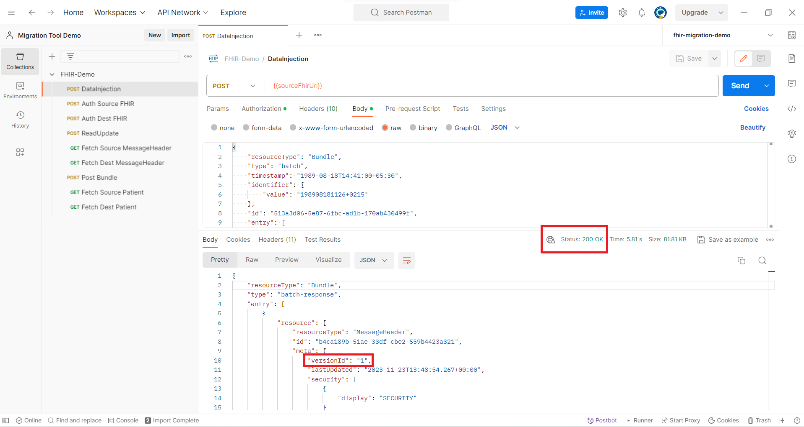
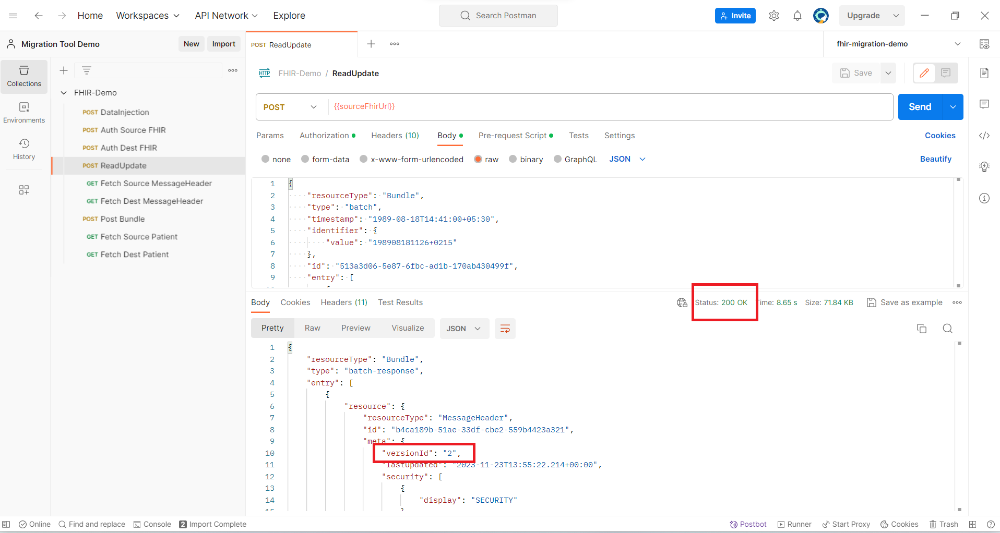

# Incremental Copy migration tool demo
This sample will guide you through deploying a demo of the migration tool using an ARM/Bicep Template and subsequently testing the server using a Postman collection.


# Prerequisites needed
1. An Azure account
    - You must have an active Azure account. If you don't have one, you can sign up [here](https://azure.microsoft.com/en-us/free/).
2. Installed and configured [Azure CLI](https://learn.microsoft.com/en-us/cli/azure/what-is-azure-cli).
    - You can download it from [here](https://aka.ms//installazurecli).
3. Postman Application.
    - If you haven't already, download and install Postman from [here](https://www.postman.com/downloads/).
4. Privilege to assign roles (User Access Adminstrator in Azure Portal).

## What will be deployed in this template
* Azure API for FHIR server (origin FHIR server)
* Azure Health Data Services workspace and FHIR server (destination FHIR server) 
* Intermediate storage account that will be used for the migration tool

## Resource Deployment using ARM/Bicep Template with Azure CLI
These steps guide you through deploying Azure resources using an ARM/Bicep Template via the Azure Command-Line Interface (CLI).

**1. Set parameters in the parameters file**
* Prior to initiating the resource deployment, it is essential to make modifications to the parameter file [ARTMTemplate.parameters.json](/infra/Demo/ARMTemplate.parameters.json).This file contains values that are specific to your deployment, including:
  * apiForFhirName: Name for the API for FHIR server that will be created (origin server)
  * workspaceName: Name for the Azure Health Data Services Workspace that will be created
  * fhirServiceName: Name for the Azure Health Data Services FHIR service that will be created (destination server)
  * storageAccountName: Name for the storage account that will act as the intermediate between the origin and destination

**2. Log in to Azure**
- Before you begin, ensure that you are logged in to your Azure account. If you are not already logged in, follow these steps:
    ```
     az login
    ```
**3. Set the Azure Subscription**
- If you have multiple Azure subscriptions and need to specify which one to use for this deployment, use the az account set command:
    ```
    az account set --subscription "<Subscription Name or Subscription ID>"
    ```
- Replace <*Subscription Name or Subscription ID*> with the name or ID of the subscription you want to use for this deployment. You can find your subscription information by running az account list.

- **Note** : This step is particularly important if you have multiple subscriptions, as it ensures that the resources are deployed to the correct subscription.

**4.Create the Resource Group**

- Use the following command to create a resource group, if you don't already have one that you want to use.
    ```
    az group create --name <resource_group_name> --location <location>
    ```
  - Replace <*resource_group_name*> with your desired name  and <*location*> with the Azure region where you want to create the resource group

**5. Deploy the Resources** 
- Now, you can initiate the deployment using the Azure CLI
    ```
    az deployment group create --resource-group<resource-group-name> --template-file <path-to-template> --parameters <path-to-parameter>
    ```
    - <*resource-group-name*>: Replace this with the name of the resource group you want to use.
    - <*path-to-template*>: Provide the path to your ARM/Bicep template file (ARMTemplate.json)
    - <*path-to-parameter*>: Specify the path to the parameters file (ARMTemplate.parameters.json)

**6. Monitor Deployment Progress**
- During deployment, the Azure CLI will provide real-time feedback, displaying status messages as it creates the resources. Monitor the progress until the deployment completes.

**7. Review Deployment Results**
- Once the deployment is finished, you will receive a confirmation message in the CLI.

Now, you have deployed a brand new Azure API for FHIR server, intermediate storage account, and a new Azure Health Data Services FHIR server. These azure resources can be used to test out the migration tool.

## Deploy Incremental Copy Migration Tool

- Follow the [instructions](/incremental-copy-docs/README.md) in this repository to deploy the incremental copy migration tool. It can now be used with your new FHIR servers for testing and demo purposes!

- Follow the above step only if you haven't already deployed the migration tool app. If you have already deployed it, you can skip the above step.

- After deploying the migration tool app, you can verify data movement from the ***API for the FHIR server*** to ***Azure Health Data Service FHIR*** using the [Data Movement Verification](/incremental-copy-docs/README.md#data-movement-verification) step.

## Postman setup to test Incremental Copy Functionality 
This section explains how to set up Postman for testing incremental copy functionality.

**1. Set Up App Registration and Assign FHIR Data Contributor Role**

- Follow **Step 1** and **Step 2** from this [document](https://github.com/microsoft/azure-health-data-services-workshop/blob/main/resources/docs/Postman_FHIR_service_README.md#getting-started) to access FHIR Services using Postman.

- **Note:** Repeat **Step 2** to assign the FHIR Data Contributor role in Azure for the Postman service client for both the *API for FHIR server* and the *Azure Health Data Service FHIR Service*.

**2. Import the Environment and Collection Files into Postman**

- Open Postman.
- Click on the "Import" button located in the top-left corner of the Postman window.
- In the file selection dialog, import the [fhir-migration-demo.postman_environment.json](fhir-migration-demo.postman_environment.json) file.
- Repeat the above steps to import the [FHIR-Demo.postman_collection.json](FHIR-Demo.postman_collection.json) file.

**3. Configure Postman Environment**
- Click on the "Environments" tab on the left in Postman and select 'fhir-migration-demo'.
- For the `fhir-migration-demo` Postman environment, retrieve the following values:
  - `tenantId` - AAD tenant ID (go to **AAD** -> **Overview** -> **Tenant ID**)
  - `clientId` - Application (client) ID for the Postman service client app (go to **AAD** -> **App registrations** -> `<postman-service-client-name>` -> **Overview** -> **Application (client) ID**)
  - `clientSecret` - Client secret stored for Postman (see the [Deploy Incremental Copy Migration Tool](#deploy-incremental-copy-migration-tool) step) 
    - hint - *client secret is generated during App Registration in AAD*
  - `sourceFhirUrl` - ***API for FHIR server*** service endpoint - e.g., `https://<fhir-service-name>.fhir.azurehealthcareapis.com` (go to **Resource Group** -> **Overview** -> `<fhir-service-name>` -> **FHIR metadata endpoint** and copy *without* "/metadata" at the end)
  - `sourceResource` - ***API for FHIR server*** service endpoint - e.g., `https://<fhir-service-name>.fhir.azurehealthcareapis.com` (same as `sourceFhirUrl`)
  - `destFhirUrl` - ***Azure Health Data Service FHIR Service*** endpoint - e.g., `https://<workspace-name>-<fhir-service-name>.fhir.azurehealthcareapis.com` (go to **Resource Group** -> **Overview** -> `<fhir-service-name>` -> **FHIR metadata endpoint** and copy *without* "/metadata" at the end)
  - `destResource` - ***Azure Health Data Service FHIR Service*** endpoint - e.g., `https://<workspace-name>-<fhir-service-name>.fhir.azurehealthcareapis.com` (same as `destFhirUrl`)

- Populate the above parameter values in your `fhir-migration-demo` Postman environment. Input the values in the CURRENT VALUE column. Leave `sourceBearerToken` and `destBearerToken` blank. Ensure to click **Save** to retain the `fhir-migration-demo` environment values.


**4. Get an access token from AAD**
- In order to connect to API for FHIR and Azure Health Data Service FHIR service, you will need to get an access token first. To obtain an access token from AAD via Postman, you can send a ```POST Auth API4Fhir``` request for API for FHIR and ```POST Auth FHIR Serv``` for  Azure Health Data Service FHIR. The ```POST Auth API4Fhir``` and ```POST Auth FHIR Serv``` call comes pre-configured as part of the `FHIR-DEMO` collection that you imported earlier. 

- In Postman, click on **Collections** on the left, select the `FHIR-DEMO` collection, and then select `POST Auth API4Fhir`. Press **Send** on the right.

- Similarly, select the `FHIR-DEMO` collection, and then select `POST Auth FHIR Serv`. Press **Send** on the right. 

**IMPORTANT:** Ensure that the `fhir-migration-demo` environment is active by selecting it from the dropdown menu above the **Send** button.

## Test incremental copy functionality
This section explains how to test incremental copy functionality using Postman.

**1. Inject Data into API for FHIR Server**

- Open the 'DataInjection' request from the FHIR-Demo Collection. If the contents of the [Body.json](Body.json) file are not already in the body tab, please paste them there. Then, select the POST method and proceed to click the send button to initiate the execution.

- If you receive a 200 OK status code with a response body, that means you have successfully injected data into the API for FHIR Server.




**2. Read-Update Data into API for FHIR Server**

- Open the 'ReadUpdate' request from the FHIR-DEMO Collection. If the contents of the [Body.json](Body.json) and the [pre-Request](Pre-request%20Script.js) script file are not already present in the body and pre-request script tab, respectively, paste them there. Then, select the POST method and proceed to click the send button to initiate the execution.

- If you receive a 200 OK status code with a response body containing updated 'versionId', that means you have successfully updated data inside the API for FHIR Server. You can also verify the same by checking for 'versionId' incremented by one, inside entry -> resource -> meta within the response body.



**3. Test Incremental Copy Functionality for MessageHeader**

- Open the 'Fetch MessageHeader' request from the FHIR-DEMO. Select the GET method and proceed to click the send button to initiate the execution.

- You will receive a 200 OK status code with a response body containing 'resourceType' as 'MessageHeader'. Check the 'versionId' inside the meta to match the same versionId that you received when sending the 'ReadUpdate' request.


- Now, open the 'Fetch MessageHeader Fhir' request from the FHIR-DEMO. Select the GET method and proceed to click the send button to initiate the execution.

- Verify the 'versionId' with the 'versionId' from the 'Fetch MessageHeader' response. If the versionIds are the same, that means the Incremental Copy Functionality is working fine.


- **Note:** You might receive a 404 Not Found error or the previous 'versionId' since the migration tool runs automatically every 5 minutes. Wait about 10 minutes to observe that the migration tool will pick up the new updates and migrate them to the server. You can also monitor this on the migration tool dashboard.

**4. Post Bundle Data into API for FHIR Server**

- Open the 'Post Bundle' request from the FHIR-DEMO Collection. If the contents of the [PostBundleBody.json](PostBundleBody.json) and the [pre-Request script](Pre-request%20Script.js) file are not already present in the body and pre-request script tab, respectively, paste them there. Then, select the POST method and proceed to click the send button to initiate the execution.

- If you receive a 200 OK status code with a response body, that means you have successfully posted bundle data inside the API for FHIR Server.


**5. Update PostBundle Data into API for FHIR Server**

- Open the 'ReadUpdate' request from the FHIR-DEMO Collection. If the contents of the [pre-Request script](Pre-request%20Script.js) file are not already present in the pre-request script tab, respectively, paste them there. Replace the content inside the body with [PostBundleBody.json](PostBundleBody.json).

- Update only the values inside the resource in the entry, excluding fields like 'resourceType', 'id', 'meta', 'text', 'extension', and 'identifier'. (For example, we have updated the family name of first resource in our context.)

- Afterward, select the POST method and proceed to click the send button to initiate the execution. 

- If you receive a 200 OK status code with a response body containing the updated 'versionId', that means you have successfully updated Post Bundle Data inside the API for FHIR Server. Verify the same by checking for 'versionId' inside entry -> resource -> meta within the response body.


- **Note** - check only for those resource which you updated. In our case it would be the first patient resource containing id : 'PQC00000011'.

**6. Test Incremental Copy Functionality for Post Bundle**

- Open the 'Fetch Patient' request from the FHIR-DEMO. Select the GET method and click the send button to initiate the execution.

- You will receive a 200 OK status code with a response body containing 'resourceType' as 'Patient'. Check the 'versionId' inside the meta to match the same versionId that you received when sending the 'ReadUpdate' request.


- Now, open the 'Fetch Patient Fhir' request from the FHIR-DEMO. Select the GET method and proceed to click the send button to initiate the execution.

- Verify the 'versionId' with the 'versionId' from the 'Fetch MessageHeader' response. If the versionIds are the same, that means the Incremental Copy Functionality is working fine.


- **Note:** You might receive a 404 Not Found error or the previous 'versionId' since the migration tool runs automatically every 5 minutes. Wait about 10 minutes to observe that the migration tool will pick up the new updates and migrate them to the server. You can also monitor this on the migration tool dashboard.


## Troubleshooting
**1. Template Deployment Errors**
- Please see the [troubleshooting section](https://learn.microsoft.com/en-us/azure/azure-resource-manager/troubleshooting/quickstart-troubleshoot-arm-deployment?tabs=azure-cli) to handle the issues of Azure Resource Manager template (ARM template) JSON deployment errors.
-  Please see the [troubleshooting section](https://learn.microsoft.com/en-us/azure/azure-resource-manager/troubleshooting/quickstart-troubleshoot-bicep-deployment?tabs=azure-cli) to handle the issues of Bicep file deployment errors.

**2. Postman Connection Issues**
- **Issue:** Unable to connect to the deployed resource.
- **Solution:**
    -   Double-check the URL and ensure it's correct.
    - Verify that your local machine has internet access.
    - Check if any firewall or network policies are blocking the connection.

**3. Authorization and Authentication**
- **Issue:** Unauthorized or Forbidden error.
- **Solution:**
    - Ensure that you have the necessary permissions to access the deployed resource.
    - Check if any access policies or role assignments need to be updated.


