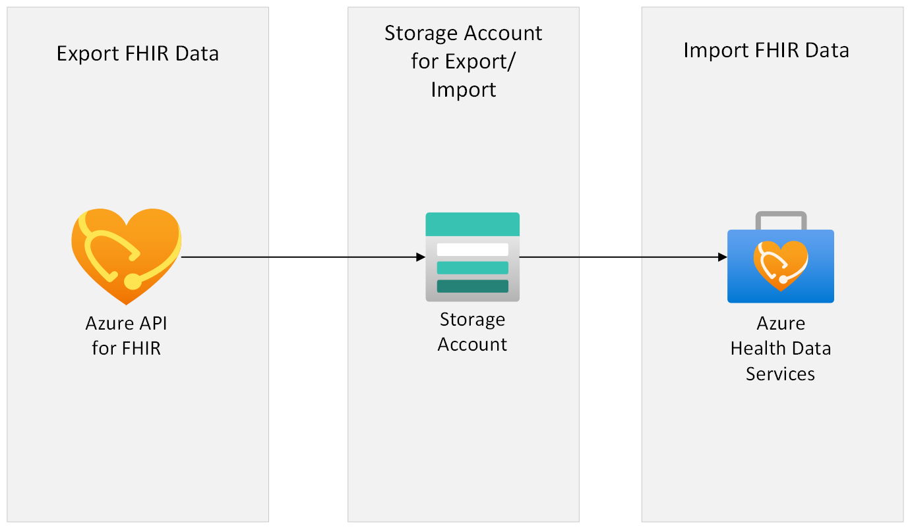

# Migrate your data from Azure API for FHIR server to Azure Health Data Services FHIR service using the Lift and Shift migration pattern

This sample will focus on how to migrate the FHIR data from Azure API for FHIR server to Azure Health Data Services FHIR service using the Lift and Shift migration pattern. This migration pattern utilizes [$export](https://learn.microsoft.com/azure/healthcare-apis/azure-api-for-fhir/export-data) (which allows you to filter and export certain data according to your [query](https://learn.microsoft.com/azure/healthcare-apis/azure-api-for-fhir/export-data#query-parameters)) to export data from a source Azure API for FHIR server, and [$import](https://learn.microsoft.com/azure/healthcare-apis/fhir/import-data) to import to Azure Health Data Service FHIR service.

## Lift and Shift migration pattern
Lift and Shift is the simplest migration pattern. It is ideal if your data pipeline can afford a large downtime during the migration process. It involves a singular $export to export all of your required data from Azure API for FHIR server to an intermediate storage account, and then calling $import to import what you've just exported into your Azure Health Data Services FHIR server.

<!---
To see the list of all recommended migration patterns, see here. #TODO add link to main readme

-->
## Architecture Overview



# Prerequisites needed
1.	Review [general migration strategies]( https://learn.microsoft.com/azure/healthcare-apis/fhir/migration-strategies) first.
2.  Microsoft work or school account
3.	FHIR instances.
	-	**Source**: Azure API for FHIR server instance from where the data will be exported from.
		- Have the Azure API for FHIR server URL handy:
			```PowerShell
			https://<<SOURCE_ACCOUNT_NAME>>.azurehealthcareapis.com/
			```
	-	**Destination**: Azure Health Data Services FHIR service instance where the data will be imported to. See [here](https://learn.microsoft.com/en-us/azure/healthcare-apis/fhir/get-started-with-fhir) for instructions on creating a new Azure Health Data Services FHIR service (and associated Azure Health Data Services [workspace](https://docs.microsoft.com/azure/healthcare-apis/healthcare-apis-quickstart)) if you don't already have one. 
		- Have the Azure Health Data Service FHIR service URL handy:
			```PowerShell
			https://<<WORKSPACE_NAME>>-<<FHIR_SERVICE_NAME>>.fhir.azurehealthcareapis.com/
			```
4.  If you have custom search parameters that you would like migrated over, you will need to first query Azure API for FHIR for your custom search parameters and receive a bundle. Then, POST that bundle of custom search parameters to the new Azure Health Data Services FHIR service. This will need to be done before migrating any data. If you want the data to be properly indexed as it gets migrated to Azure Health Data Services FHIR service, use [incremental mode](https://learn.microsoft.com/en-us/azure/healthcare-apis/fhir/import-data#incremental-mode) for $import. Otherwise, you will need to run a reindex at the end of migration. 

	- You can use a sample Powershell script that will migrate the FHIR custom search parameter from Azure API for FHIR server to Azure Health Data Services FHIR service for you.
	Follow this [document](https://github.com/Azure-Samples/azure-health-data-and-ai-samples/tree/main/samples/lift-shift) to learn more about the sample script.

## Steps

At a high level, the steps are:


Azure API for FHIR server data export:  

* [Configure Azure API for FHIR for bulk export](https://docs.microsoft.com/azure/healthcare-apis/azure-api-for-fhir/configure-export-data) 

* [FHIR server bulk data export](https://docs.microsoft.com/azure/healthcare-apis/azure-api-for-fhir/export-data)

  

AHDS FHIR service data import:  

* [Configure FHIR service for bulk import](https://docs.microsoft.com/azure/healthcare-apis/fhir/configure-import-data)  

* [FHIR service bulk import](https://docs.microsoft.com/azure/healthcare-apis/fhir/import-data)


Detailed steps:

1. Export data from the **source** Azure API for FHIR server.
	
	1. Follow steps [here](https://learn.microsoft.com/azure/healthcare-apis/azure-api-for-fhir/configure-export-data) to configure settings for export on Azure API for FHIR server. The steps list [query parameters](https://learn.microsoft.com/azure/healthcare-apis/azure-api-for-fhir/export-data#query-parameters) that can be used to filter what data gets exported (for example, using _since and _till query parameters).

	2. Once the export configuration is setup, run the export command on Azure API for FHIR server.
	Follow the [steps](https://learn.microsoft.com/azure/healthcare-apis/azure-api-for-fhir/export-data) to run the export command.
		- The GET commands can be run on Postman.
		**Examples**:  
			If you'd like to run a system export:
			``` PowerShell
			GET https://<<Source FHIR Server URL>>/$export?_container=<<CONTAINER NAME>>
			```
			If you'd like to export per resource:
			``` PowerShell
			GET https://<<Source FHIR Server URL>>/$export?_container=<<CONTAINER NAME>>&_type=<<RESOURCE TYPE>>
			```
			**NOTE** : Specify the container name where the export of the resources will be done. If the container is not present in the storage account, the export command will create it.

		- If you export per resource, you will need to manually run the above command once per resource type. Execute the export jobs in parallel to minimize wait times, and note down the job IDs to check the execution status for each export job. 
	
		- You can check the $export operation status through the URL in the Content-Location header that is returned in the FHIR service response. It will be in this format:
	
			```PowerShell
			https://<<SOURCE_ACCOUNT_NAME>>.azurehealthcareapis.com/_operations/export/<<JOB_ID>>
			```

			You can then use Postman to GET the $export operation status, for example:
			```PowerShell
			GET https://<<SOURCE_ACCOUNT_NAME>>.azurehealthcareapis.com/_operations/export/<<JOB_ID>>
			```
			If the Status return is 202 Accepted, it means the export job is still in progress and you can check that the files are being created in the container.

			If the status return is 200 Completed, it means the export job is completed. All of the requested data has been exported to the container.\
			Once it is completed, it will give type, URL and count of the resources exported. Note down the exported FHIR resource count as it will be useful in verifying that all your data was moved successfully later.

			More details on [Bulk Data Status request](https://hl7.org/fhir/uv/bulkdata/export/index.html#bulk-data-status-request).
	
	3. The exported data will be in the format of NDJSON files that are stored in a new container which was created during the export configuration process.

2. Import data to the **destination** Azure Health Data Services FHIR service.

	1. Follow steps [here](https://learn.microsoft.com/azure/healthcare-apis/fhir/configure-import-data) to configure settings for import on Destination Azure Health Data Services FHIR Service.


	   __Note__: Please review the [$import documentation](https://learn.microsoft.com/en-us/azure/healthcare-apis/fhir/import-data#import-operation-modes) carefully to see the differences between initial mode and incremental mode, and choose the mode that best suits your needs. For example, if you wish to migrate historical versions and lastUpdated field values, you will need to use incremental mode. 
	
		__Note__: These instructions assume using the same storage account for $export from Azure API for FHIR and $import for Azure Health Data Services FHIR service. However, if you need to migrate data across two different subscriptions (the two subscriptions should be in the same region and Tenant ID) and cannot use the same storage account for $import and $export, you can follow the below steps to get the data copied over to the $import storage account:

		- Use AzCopy command to copy the exported data from the export storage account to the import container configured for the AHDS FHIR server. Subsequently, you can proceed to create import payloads manually, and initiate the import process.This ensures smooth data migration within the same and across subscriptions.
		

		- How to use AzCopy 
			- Download [AzCopy](https://learn.microsoft.com/en-us/azure/storage/common/storage-use-azcopy-v10) if you don't already have it.

    		1. Go to the downloaded folder of azcopy.
    		2. Login to Azcopy with tenant id using below command
				```Powershell
				azcopy login --tenant-id 'xxxx-xxxx-xxxx-xxxx'  
				```
    		3. Run below command to copy the exported data from storage account configured for Azure API for FHIR to another storage account which is configured with Azure Health Data service FHIR service for import

				```Powershell
				azcopy copy 'https://{SourcestorageAccountName}.blob.core.windows.net/{ContainerName}/*' 'https://{DestinationstorageAccountName}.blob.core.windows.net/{ContainerName}' --recursive
				```

        - Move on to step 2a. If you are using different storage accounts, you must prepare the $import body payload manually. You cannot use the automated powershell script in this case.
		
	
	2. Prepare the $import body payload. <br> 
	
	   Options: <br> 
	  a. You can prepare this manually by following $import documentation [here](https://learn.microsoft.com/en-us/azure/healthcare-apis/fhir/import-data#calling-import). Please note, if you are using two different storage accounts, you must use this option. <br> <br>
	  b. Or, you can use the included OSS Powershell script in this repo that will automatically create the $import body payload from the export storage container for you. Please note, this Powershell script assumes that you have the same storage account for both $import and $export. If you are using two different storage accounts (for example, migrating data across subscriptions), you will need to use option A above  "prepare the $import body payload manually". <br> <br>
		__Note__: When creating import payloads with a PowerShell script, make sure to use the same storage account while configuring the import on AHDS FHIR service which was configured for $export.This ensures smooth data migration of resources within the same and across subscriptions.
	 The following explains how to use the $import body payload Powershell script:
   
   	- The PowerShell script will take the $export Content-Location as a parameter and will create the $import body payload that will be used when executing the $import command.
	
		- To run the PowerShell Script, you need to have the "FHIR Data Contributor" role for the Azure Health Data Services FHIR Service, as the script require access to the $export command output. Follow [steps](https://learn.microsoft.com/azure/healthcare-apis/configure-azure-rbac#assign-roles-for-the-fhir-service) to configure roles on AHDS FHIR services.
		
		- Follow  steps to execute the $import payload script:

			1. You can run the Powershell script locally, or you can use [Open Azure Cloud Shell](https://shell.azure.com) - you can also access this from [Azure Portal](https://portal.azure.com).\
			More details on how to setup [Azure Cloud Shell](https://learn.microsoft.com/azure/cloud-shell/overview)

				- If using Azure Cloud Shell, select PowerShell for the environment 
				- Clone this repo
					```azurecli
					git clone https://github.com/Azure/fhir-migration-tool.git --depth 1
					```
				- Change working directory to the repo directory
					```azurecli-interactive
					cd $HOME/fhir-migration-tool
					```
			2. Sign into your Azure account
				``` PowerShell
				az account set -s 'xxxx-xxxx-xxxx-xxxx-xxxxxx'
				```
				where 'xxxx-xxxx-xxxx-xxxx-xxxxxx' is your subscription ID.

			3. Browse to the scripts folder under this path (..\fhir-migration-tool\lift-and-shift-resources\scripts).

			4. Run the following PowerShell script. 
				```Powershell
				./Import_Payload.ps1 -url '<$export Content-Location URL>' 
				```
				
				|Parameter   | Description   |
				|---|---|
				| url | $export Content_Location URL . 

				Example:
				``` PowerShell
				./Import_Payload.ps1 -url 'https://<<SOURCE_ACCOUNT_NAME>>.azurehealthcareapis.com/_operations/export/<<JOB_ID>>'"
				```

	- Once the import configuration is setup and $import body payload is created (optional), run the import command on Azure Health Data Services FHIR service.
	Follow the [steps](https://learn.microsoft.com/azure/healthcare-apis/fhir/import-data) to run the import command.

	- Follow steps [here](https://learn.microsoft.com/azure/healthcare-apis/fhir/import-data#checking-import-status) to check the $import operation status .

	__Note__: Check the [performance consideration](https://learn.microsoft.com/azure/healthcare-apis/fhir/import-data#performance-considerations) for better throughput of $import operation.

## Troubleshooting

1. Azure API for FHIR.
	-  Please see the [troubleshooting section](https://learn.microsoft.com/azure/healthcare-apis/fhir/export-data#troubleshoot) to handle issues on exporting the data.
2. Azure Health Data Services FHIR service.
	-  Please see the [troubleshooting section](https://learn.microsoft.com/azure/healthcare-apis/fhir/import-data#troubleshooting) to handle issues on importing the data.

## Data Movement Verification

If you'd like to verify that all of your exported FHIR data was successfully imported into the new FHIR server, follow these steps. This verification will only work if the destination Azure Health Data Services FHIR service was initially empty. 

- Get the exported FHIR resource count(s). You have noted the value(s) in step 2 of : **Export data from the **source** Azure API for FHIR server.**
- Now run the below command to check the resource count on destination Azure Health Data Services FHIR service.  
	If you have done the export on system level run the below command to check the total resource count on destination Azure AHDS FHIR Service.
	```PowerShell
	GET https://<<WORKSPACE_NAME>>-<<FHIR_SERVICE_NAME>>.fhir.azurehealthcareapis.com/?_summary=count
	```
	If you have done the export export at resource type level, run the below command per resource type:
	```PowerShell
	GET https://<<WORKSPACE_NAME>>-<<FHIR_SERVICE_NAME>>.fhir.azurehealthcareapis.com/<<RESOURCE_NAME>>?_summary=count
	```
- Compare the count(s) with exported FHIR resource count(s) to make sure that they match.

**NOTE** : Destination AHDS FHIR Service should not be used by any other applications or users until the FHIR Import completes the process, as it will lead to miscount of the resources. 

## Resource Cleanup

If you'd like to delete the resources that were successfully migrated from Azure API for FHIR as well as from the intermediate storage containers that were created during this process, follow these steps:
- Note: Please verify that all your data moved over (See above section "Data Movement Verification" before deleting the old resources. 
	- Delete the Source Azure API for FHIR server once the data movement is verified.
	- Delete the container where the export is done.
	- Delete the blob data from storage account.

	Run the below command on Azure Cloud Shell to delete all blob from specific container.
	```PowerShell
	az storage blob delete-batch --source "<<CONTAINER_NAME>>" --account-name "<<STORAGE_ACCOUNT_NAME>>" --pattern *
	```
	|Parameter   | Description   |
	|---|---|
	| CONTAINER_NAME | Container Name from where the data need to be removed. |
	| STORAGE_ACCOUNT_NAME | Storage account name where the Container is present. 
