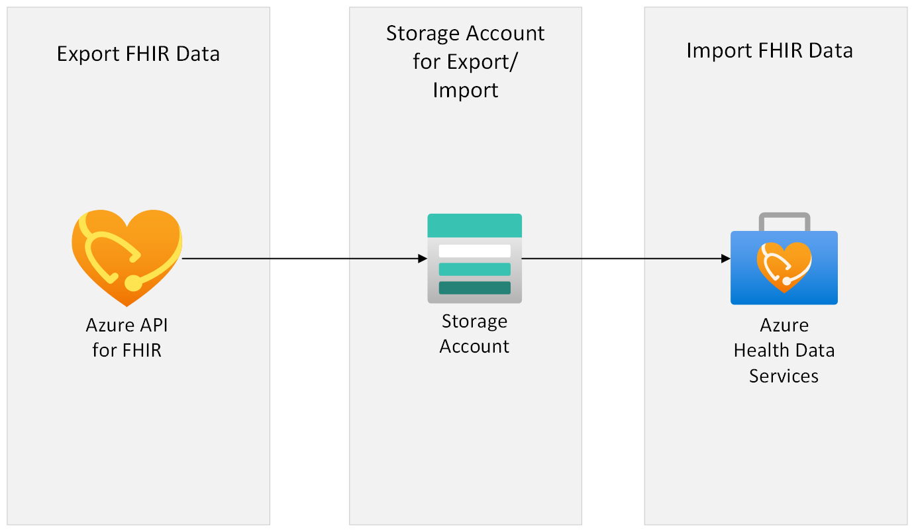

# Migrating data from Azure API for FHIR server to Azure Health Data Services FHIR service

This sample will focus on how to migrate the FHIR data from Azure API for FHIR server to Azure Health Data Services FHIR service. This sample script utilizes [$export](https://learn.microsoft.com/azure/healthcare-apis/azure-api-for-fhir/export-data) (which allows you to filter and export certain data according to your [query](https://learn.microsoft.com/azure/healthcare-apis/azure-api-for-fhir/export-data#query-parameters)) to export data from a source Azure API for FHIR server, and [$import](https://learn.microsoft.com/azure/healthcare-apis/fhir/import-data) to import to Azure Health Data Service FHIR service.

## Architecture Overview



# Prerequisites needed
1.	Microsoft work or school account
2.	FHIR instances.
	-	**Source**: Azure API for FHIR server instance from where the data will be exported from.
		- Get the Azure API for FHIR server URL:
			```PowerShell
			https://<<SOURCE_ACCOUNT_NAME>>.azurehealthcareapis.com/
			```
	-	**Destination**: Azure Health Data Service FHIR service instance where the data will be imported to.
		- Get the Azure Health Data Service FHIR service URL:
			```PowerShell
			https://<<WORKSPACE_NAME>>-<<FHIR_SERVICE_NAME>>.fhir.azurehealthcareapis.com/
			```
## Steps

1. Export data from the **source** Azure API for FHIR server.
	
	1. Follow steps [here](https://learn.microsoft.com/azure/healthcare-apis/azure-api-for-fhir/configure-export-data) to configure settings for export on Azure API for FHIR server. The steps list [query parameters](https://learn.microsoft.com/azure/healthcare-apis/azure-api-for-fhir/export-data#query-parameters) that can be used to filter what data gets exported (for example, using _since and _till query parameters).

	2. Once the export configuration is setup, run the export command on Azure API for FHIR server.
	Follow the [steps](https://learn.microsoft.com/azure/healthcare-apis/azure-api-for-fhir/export-data) to run the export command.
		- The GET commands can be run on Postman.
		**Examples**:  
			If you'd like to run a system export:
			``` PowerShell
			GET https://<<Source FHIR Server URL>>/$export?_container=<<CONTAINER NAME>>
			```
			If you'd like to export per resource:
			``` PowerShell
			GET https://<<Source FHIR Server URL>>/$export?_container=<<CONTAINER NAME>>&_type=<<RESOURCE TYPE>>
			```
			**NOTE** : Specify the container name where the export of the resources will be done. If the container is not present in storage account export command will create it.

		- If you export per resource, you will need to manually run the above command once per resource type. Execute the export jobs in parallel to minimize wait times, and note down the job IDs to check the execution status for each export job. 
	
		- You can check the $export operation status through the URL in the Content-Location header that is returned in the FHIR service response. It will be in this format:
	
			```PowerShell
			https://<<SOURCE_ACCOUNT_NAME>>.azurehealthcareapis.com/_operations/export/<<JOB_ID>>
			```

			You can then use Postman to GET the $export operation status, for example:
			```PowerShell
			GET https://<<SOURCE_ACCOUNT_NAME>>.azurehealthcareapis.com/_operations/export/<<JOB_ID>>
			```
			If the Status return is 202 Accepted, it means the export job is still in progress and you can check that the files are being created in the container.

			If the status return is 200 Completed, it means the export job is completed. All of the requested data has been exported to the container.\
			Once it is completed, it will give type, URL and count of the resources exported. Note down the exported FHIR resource count as it will be useful in verifying that all your data was moved successfully later.

			More details on [Bulk Data Status request](https://hl7.org/fhir/uv/bulkdata/export/index.html#bulk-data-status-request).
	
	3. The exported data will be in the format of NDJSON files that are stored in a new container which was created during the export configuration process.

2. Import data to the **destination** Azure Health Data Services FHIR service.

	1. Follow steps [here](https://learn.microsoft.com/azure/healthcare-apis/fhir/configure-import-data) to configure settings for import on Destination Azure Health Data Services FHIR Service.
	
		__Note__: Use the same storage account while configuring the import on AHDS FHIR service which was configured for $export.
	
	2. Run PowerShell script to create $import body payload. It's optional, user can use these steps to create $import bodies payload Or skip this step and execute the $import command in step 3 as per the requirement.
		
		The PowerShell script will take the $export Content-Location as parameter and will create the $import body payload that will be use during executing the $import command.
	
		- To run the PowerShell Script user need to have FHIR Data contributor role on AHDS FHIR Service as script require token to access the $export command output. Follow [steps](https://learn.microsoft.com/azure/healthcare-apis/configure-azure-rbac#assign-roles-for-the-fhir-service) to configure role on AHDS FHIR services.
		
		- Follow the steps to execute the script:

			1. You can run the Powershell script locally Or can use [Open Azure Cloud Shell](https://shell.azure.com) - you can also access this from [Azure Portal](https://portal.azure.com).\
			More details on how to setup [Azure Cloud Shell](https://learn.microsoft.com/azure/cloud-shell/overview)

				- If using Azure Cloud Shell, select PowerShell for the environment 
				- Clone this repo
					```azurecli
					git clone https://github.com/Azure/fhir-migration-tool.git --depth 1
					```
				- Change working directory to the repo directory
					```azurecli-interactive
					cd $HOME/fhir-migration-tool
					```
			2. Sign into your Azure account
				``` PowerShell
				az account set -s 'xxxx-xxxx-xxxx-xxxx-xxxxxx'
				```
				where 'xxxx-xxxx-xxxx-xxxx-xxxxxx' is your subscription ID.

			3. Browse to the scripts folder under this path (..\fhir-migration-tool\v0\scripts).

			4. Run the following PowerShell script. 
				```Powershell
				./Import_Payload.ps1 -url '<$export Content-Location URL>' 
				```
				|Parameter   | Description   |
				|---|---|
				| url | $export Content_Location URL . 

				Example:
				``` PowerShell
				./Import_Payload.ps1 -url 'https://<<SOURCE_ACCOUNT_NAME>>.azurehealthcareapis.com/_operations/export/<<JOB_ID>>'"
				```

	3. Once the import configuration is setup and $import body payload is created (optional), run the import command on Azure Health Data Services FHIR service.
	Follow the [steps](https://learn.microsoft.com/azure/healthcare-apis/fhir/import-data) to run the import command.

	4. Follow steps [here](https://learn.microsoft.com/azure/healthcare-apis/fhir/import-data#checking-import-status) to check the $import operation status .

## Troubleshooting

1. Azure API for FHIR.
	-  Please see the [troubleshooting section](https://learn.microsoft.com/azure/healthcare-apis/fhir/export-data#troubleshoot) to handle issues on exporting the data.
2. Azure Health Data Services FHIR service.
	-  Please see the [troubleshooting section](https://learn.microsoft.com/azure/healthcare-apis/fhir/import-data#troubleshooting) to handle issues on importing the data.

## Data Movement Verification

If you'd like to verify that all of your exported FHIR data was successfully imported into the new FHIR server, follow these steps. This verification will only work if the destination Azure Health Data Services FHIR service was initially empty. 

- Get the exported FHIR resource count(s). You have noted the value(s) in step of : **Export data from the **source** Azure API for FHIR server.**
- Now run the below command to check the resource count on destination Azure Health Data Services FHIR service.  
	If you have done the export on system level run the below command to check the total resource count on destination Azure AHDS FHIR Service.
	```PowerShell
	GET https://<<WORKSPACE_NAME>>-<<FHIR_SERVICE_NAME>>.fhir.azurehealthcareapis.com/?_summary=count
	```
	If you have done the export export at resource type level, run the below command per resource type:
	```PowerShell
	GET https://<<WORKSPACE_NAME>>-<<FHIR_SERVICE_NAME>>.fhir.azurehealthcareapis.com/<<RESOURCE_NAME>>?_summary=count
	```
- Compare the count(s) with exported FHIR resource count(s) to make sure that they match.

**NOTE** : Destination AHDS FHIR Service should not be used by any other applications or users until the FHIR Import completes the process, as it will lead to miscount of the resources. 

## Resource Cleanup

If you'd like to delete the resources that were successfully migrated from Azure API for FHIR as well as from the intermediate storage containers that were created during this process, follow these steps:
- Note: Please verify that all your data moved over (See above section "Data Movement Verification" before deleting the old resources. 
	- Delete the Source Azure API for FHIR server once the data movement is verified.
	- Delete the container where the export is done.
	- Delete the blob data from storage account.

	Run the below command on Azure Cloud Shell to delete all blob from specific container.
	```PowerShell
	az storage blob delete-batch --source "<<CONTAINER_NAME>>" --account-name "<<STORAGE_ACCOUNT_NAME>>" --pattern *
	```
	|Parameter   | Description   |
	|---|---|
	| CONTAINER_NAME | Container Name from where the data need to be removed. |
	| STORAGE_ACCOUNT_NAME | Storage account name where the Container is present. 
